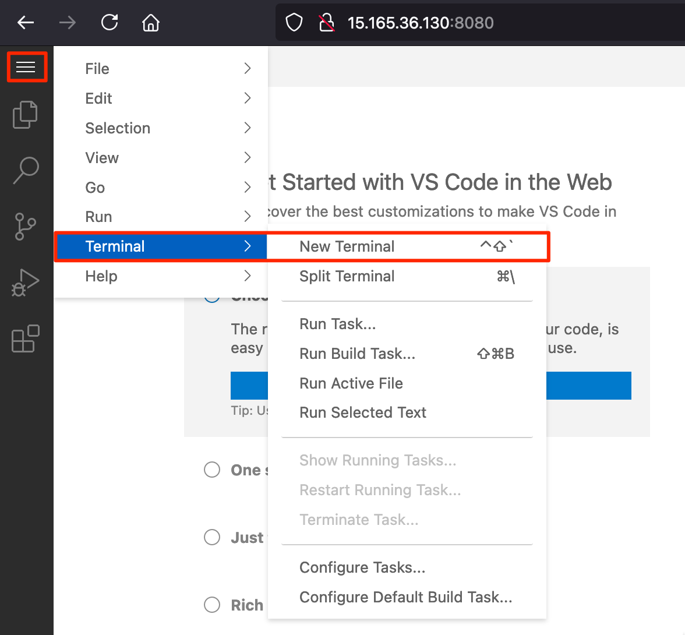

# 사전 준비

## 0.시작에 앞서&#x20;

GWLB & ANFW(AWS Network Firewall) Workshop은 AWS 워크로드를 보호하기 위해서, TGW를 활용한 Centralized Design 방법으로 GWLB와 ANFW을 구성하는 방법을 제공합니다

#### GWLB Design  -  TransitGateway를 기반으로 Centralized 기반으로 구성합니다. 외부에 서비스를 제공하기 위해 ALB를 구성합니다. 내부 Private Subnet 자원들의 패치를 위해 NAT Gateway를 구성합니다.

보안 어플라이언스는 상용 방화벽이나 기타 어플라이언스를 연동 가능합니다. 이 랩에서는 리눅스 기반 IPTABLE을 사용합니다.

#### ANFW Design  -  TransitGateway를 기반으로 Centralized 기반으로 구성합니다. 외부에 서비스를 제공하기 위해 ALB를 구성합니다. 내부 Private Subnet 자원들의 패치를 위해 NAT Gateway를 구성합니다.

AWS의 완전관리형 방화벽을 구성해서, 내외부 보안 정책을 구현해 봅니다. &#x20;

## 1.VSCode 서버 설치

**VS Code Server**는 Microsoft의 Visual Studio Code 편집기를 클라우드 환경 또는 원격 서버에서 실행할 수 있도록 설계된 소프트웨어입니다. 이는 개발자가 로컬 머신에 설치하지 않고도 어디서나 웹 브라우저를 통해 VS Code의 기능을 사용할 수 있게 해줍니다. 특히, 자원을 많이 소비하는 작업을 원격 서버에서 처리하거나, 팀이 협업할 때 동일한 개발 환경을 제공하는 데 유용합니다.

#### 주요 특징

1. **원격 개발 환경**: VS Code Server를 사용하면 로컬 머신의 성능에 의존하지 않고도 원격 서버의 자원을 활용하여 개발 작업을 수행할 수 있습니다. 이는 특히 대규모 데이터 처리나 컴파일 작업이 필요한 경우 유용합니다.
2. **웹 기반 접근**: 사용자는 웹 브라우저를 통해 어디서나 VS Code Server에 접근할 수 있습니다. 이를 통해 다양한 기기에서 동일한 개발 환경을 유지할 수 있습니다.
3. **플러그인 지원**: 로컬 VS Code와 마찬가지로, 다양한 플러그인과 확장 기능을 설치하여 개발 환경을 확장할 수 있습니다.
4. **보안**: 비밀번호 보호 및 HTTPS 지원을 통해 원격 개발 환경의 보안을 강화할 수 있습니다. 사용자는 비밀번호를 설정하여 무단 접근을 방지할 수 있으며, SSL 인증서를 사용하여 통신을 암호화할 수 있습니다.
5. **협업**: 여러 개발자가 동시에 동일한 프로젝트에 접근하여 작업할 수 있어, 팀 협업에 매우 유리합니다.

#### 사용 사례

* **클라우드 개발 환경**: 클라우드 상의 인프라를 활용하여 개발 환경을 구축하고, 이를 통해 다양한 작업을 수행할 수 있습니다.
* **학습 및 교육**: 교육 기관이나 코딩 부트캠프에서 일관된 개발 환경을 제공하여 학습 효율성을 높일 수 있습니다.
* **원격 근무**: 개발자들이 물리적 위치에 관계없이 동일한 개발 환경에서 작업할 수 있도록 지원합니다.

#### 설치 및 설정

VS Code Server는 다양한 방법으로 설치할 수 있으며, 일반적으로 다음과 같은 단계를 따릅니다:

1. **서버 환경 준비**: 원격 서버에 VS Code Server를 설치할 준비를 합니다.
2. **다운로드 및 설치**: 공식 GitHub 릴리즈 페이지에서 최신 버전을 다운로드하고 설치합니다.
3. **설정 파일 구성**: `config.yaml` 파일을 생성하여 서버 설정을 구성합니다.
4. **서비스 관리**: `systemd`와 같은 서비스 관리 도구를 사용하여 VS Code Server를 시작하고, 부팅 시 자동으로 시작되도록 설정합니다.

VS Code Server는 개발자들이 원격 환경에서 편리하게 코딩하고 협업할 수 있도록 도와주는 강력한 도구입니다. 이를 통해 개발 프로세스의 유연성과 효율성을 높일 수 있습니다.

VSCode를 실행하기 위해 아래와 같이 AWS 관리콘솔에서 **`"Cloudshell"`** 을 사용해서 구성합니다.

<figure><figcaption></figcaption></figure>

`아래와 같이 iam user와 패스워드, user를 위한 Policy를 생성해서 연결합니다.`

```
export user_name=user01
export pass_word=1234Qwer
aws iam create-user --user-name ${user_name}
aws iam create-login-profile --user-name ${user_name} --password ${pass_word} --no-password-reset-required
aws iam attach-user-policy --user-name ${user_name} --policy-arn arn:aws:iam::aws:policy/AdministratorAccess
```

제공된 AWS 계정에 손쉽게 접근하기  위해서 Alisa를 생성합니다. Alias는 고유해야 하므로 , 중복되지 않도록 합니다.

```
aws iam create-account-alias --account-alias ${alias-name}
```

앞서 생성한 Alias로 접속하고, 새로운 User로 인증해서 로그인 합니다.

정상적으로 접속하면, 다시 CloudShell을 사용해서 , VSCode Server를 구성합니다.

```
# 아래 git을 cloudshell에 복제합니다.
git clone https://github.com/whchoi98/ec2_vscode.git

```

### 2.VSCode Server  구성

CloudShell에서 VSCode 서버를 구성하기 위한 환경 변수를 정의합니다. VSCode Server는 Default VPC, Public Subnet에 설치합니다.

```
source ~/.bash_profile
export AWS_REGION=ap-northeast-2
~/ec2_vscode/defaultvpcid.sh
source ~/.bashrc

```

Cloudshell에서 Cloudformation 을 배포해서 VSCode 서버를 구성합니다.

```
aws cloudformation deploy \
  --template-file "~/ec2_vscode/ec2vscode.yaml" \
  --stack-name=ec2vscodeserver \
  --parameter-overrides \
    InstanceType=t3.xlarge \
    AMIType=AmazonLinux2023 \
    DefaultVPCId=$DEFAULT_VPC_ID \
    PublicSubnetId=$PUBLIC_SUBNET_ID \
  --capabilities CAPABILITY_NAMED_IAM


```

10분 이후 VSCode 서버가 생성됩니다.

cloudshell 에서 아래 Shell을 실행시켜, vscode server의 Public IP를 확인하고, VSCode에 접속합니다.

```
~/ec2_vscode/vscode_ip.sh

```

아래는 출력예제 입니다.

```
$ ~/ec2_vscode/vscode_ip.sh 
EC2VSCodeServer = 15.165.36.130
CodeServer Connect = 15.165.36.130:8080
```

해당 VSCodeServer 공인 IP 주소로 접속합니다.

```
EC2SVSCodeServer:8080
```

EC2가 완전하게 배포된 후 3\~5분 뒤에 브라우저에서 EC2VSCodeServer PublicIP:8080으로 접속합니다.

<figure><figcaption></figcaption></figure>

EC2VSCodeServer Terminal에서 아래를 실행합니다.

```
git clone https://github.com/whchoi98/ec2_vscode.git

```

VSCodeServer는 패스워드 설정이 되어 있지 않습니다.

비밀번호 설정을 확인하고, 적절한 비밀번호로 변경한 후 다음 스크립트를 실행합니다.

**`vscode_pwd.sh`** 의 기본 패스워드는 **`1234Qwer`** 입니다.

```
cat ~/ec2_vscode/vscode_pwd.sh

~/ec2_vscode/vscode_pwd.sh

```

이제 다시 브라우저에서 재접속합니다.

이 랩의 모든 콘솔은 VSCode Server 터미널에서 수행합니다.
